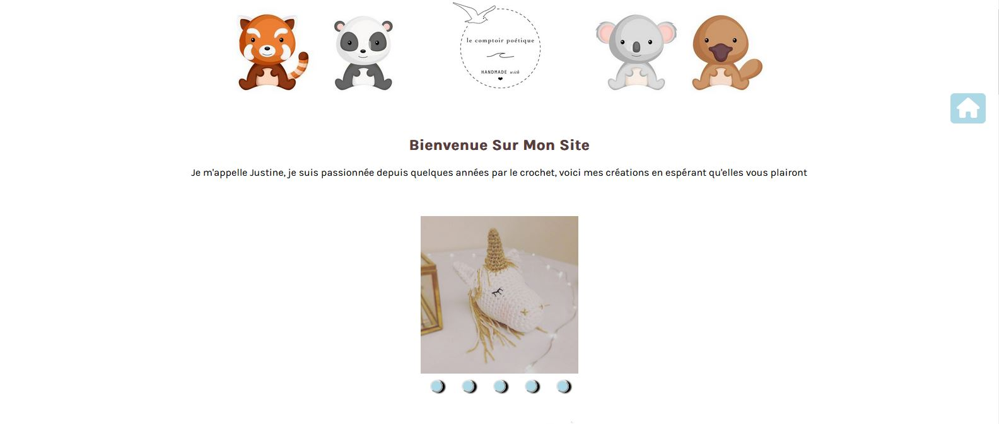

# Site, le comptoir poétique

## Table des matières <!-- titre de niveau 2 car 2 # soit h2-->
1. [Information général](#Information-général-) <!-- (#...) Ancre lien vers notre info Général -->
2. [Technologies](#technologies)
3. [Installation](#installation)
4. [Collaboration](#collaboration)
5. [FAQS](#faqs)

### Information général <!-- titre de niveau 3 car 3 # soit h3-->
*** <!-- Ligne de séparation horizontale -->
Bienvenue au Comptoir Poétique, votre destination pour des créations en crochet uniques et adorables ! Parcourez notre collection d'amigurumis faits à la main avec amour, et découvrez le cadeau parfait pour les enfants et les adultes. Que vous recherchiez une peluche câline, une décoration de maison charmante ou un projet de crochet créatif, vous trouverez ici des créations qui éveilleront votre imagination et réchaufferont votre cœur. Explorez notre catalogue et laissez-vous inspirer par nos designs originaux, ou plongez dans nos patrons pour créer votre propre chef-d'œuvre en crochet. Bienvenue dans le monde enchanté du Comptoir Poétique, où chaque pièce raconte une histoire unique et poétique.

### Présentation du site
 <!-- création d'un lien -->

### Technologies Utilisées
---
Voici les technologies que j'ai utilisé pour développer ce projet :

* **Front-end**
  - HTML
  - CSS
  - JavaScript
  
* **Back-end**
  - PHP Version 8.2.12

* **Base de Données**
  - [MySQL](http://localhost/phpmyadmin/) - Version 10

## Installation
---
Pour installer et exécuter ce projet localement, suivez ces étapes :

1. Clonez le dépôt GitHub :
    ```
   $ git clone https://github.com/TimotheeCresson/Projet-Crochet.git
   ```

2. Assurez-vous d'avoir un serveur web avec PHP installé sur votre machine. Si ce n'est pas le cas, installez un serveur tel que Apache ou Nginx avec PHP.

3. Placez les fichiers du projet dans le répertoire de votre serveur web. Par exemple, pour Apache, cela pourrait être le dossier "htdocs", et pour Nginx, le dossier "www".

4. Créez une base de données MySQL pour le projet. Vous pouvez utiliser phpMyAdmin ou tout autre outil de gestion de base de données pour créer la base de données.

5. Importez le schéma de base de données fourni avec le projet dans votre base de données.

6. Assurez-vous que les informations de connexion à la base de données sont correctes dans les fichiers de configuration de votre projet.

7. Lancez votre serveur web et accédez au projet dans votre navigateur. Par exemple, si vous utilisez Apache, vous pouvez accéder au projet en visitant http://localhost/nom-de-votre-projet.

## Collaboration
---
Si vous souhaitez contribuer à ce projet ou signaler des problèmes, voici la marche à suivre :

1. **Contribuer au code** :
    1. Forkez le projet.
    2. Créez une nouvelle branche (`git checkout -b nom-de-votre-branche`).
    3. Committer vos modifications (`git commit -am 'modification'`).
    4. Poussez vers la branche (`git push origin feature/modification`).
    5. Créez une nouvelle Pull Request.

2. **Signaler des problèmes** : Utilisez la fonctionnalité des issues GitHub pour signaler tout problème ou bug que vous rencontrez. Assurez-vous de fournir une description détaillée du problème et, si possible, des étapes pour le reproduire.
3. **Poser des questions** : Si vous avez des questions sur le fonctionnement du projet, n'hésitez pas à ouvrir une issue pour poser votre question.

## Problèmes Connus
---
Voici quelques problèmes connus dans le projet :

1. **Problème au niveau de l'enregistrement du Panier** :
   Lorsqu'un utilisateur met des articles dans son panier et se déconnecte, le panier persiste. Cependant, si un autre utilisateur se connecte après, le panier déjà rempli par une autre personne est attribué à cet utilisateur. Voir la section [À Faire](#à-faire).

2. **Problème pour éditer les articles dans le Dashboard** :
   La fonctionnalité permettant d'éditer un article dans le Dashboard n'est pas opérationnelle, car tous les articles sont stockés dans un fichier data.json. Voir la section [À Faire](#à-faire).

Si vous découvrez d'autres problèmes, n'hésitez pas à les signaler en ouvrant une nouvelle issue dans notre dépôt GitHub.

## À Faire
---
Voici quelques fonctionnalités que je prévoies d'implémenter dans le futur :

1. **Enregistrement du Panier pour les Utilisateurs** :
   Pour résoudre le problème d'enregistrement du Panier pour les utilisateurs, je prévoies de créer une nouvelle table dans notre base de données pour stocker les informations sur les articles et les paniers des utilisateurs. Actuellement, les articles sont stockés dans un fichier data.json, je fois les transférer dans notre base de données.

2. **Fonctionnalité d'Édition des Articles dans le Dashboard** :
   Afin de permettre aux utilisateurs de modifier les articles dans le Dashboard, je dois également implémenter la gestion des articles dans notre base de données. Cela me permettra de modifier et de mettre à jour les articles directement depuis la base de données.

Si vous avez d'autres suggestions ou idées pour améliorer le projet, n'hésitez pas à les partager en ouvrant une nouvelle issue dans notre dépôt GitHub.

## FAQ
---
Voici quelques questions que vous pouvez potentiellement vous poser, accompagnées de leurs réponses :

1. **En quoi consiste le projet ?**
   _"Le projet "Le Comptoir Poétique" est un site e-commerce de vente de création en crochet, plus précisément d'Amigurumi et de patron.

2. **Comment puis-je contribuer à ce projet ?**
   _"Je suis ravis que vous souhaitiez y contribuer ! Pour contribuer au projet, veuillez suivre les instructions dans la section [Collaboration](#collaboration) de ce README."_

3. **J'ai trouvé un problème dans le projet, que dois-je faire ?**
   _"Merci de m'en tenir informés ! Veuillez signaler le bug en ouvrant une issue dans mon dépôt GitHub.(https://github.com/TimotheeCresson/Projet-Crochet) Assurez-vous de fournir autant de détails que possible sur le bug et, si possible, des étapes pour le reproduire."_

N'hésitez pas à poser d'autres questions en ouvrant une nouvelle issue dans mon dépôt GitHub.

